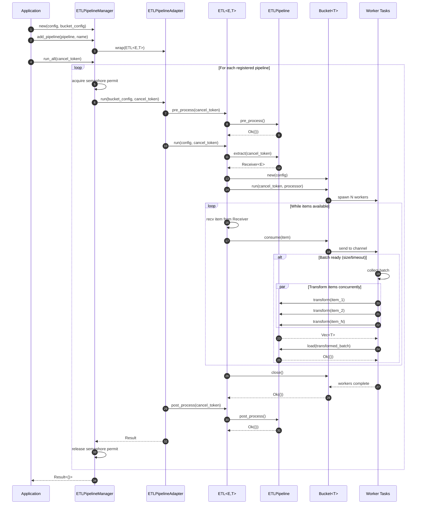
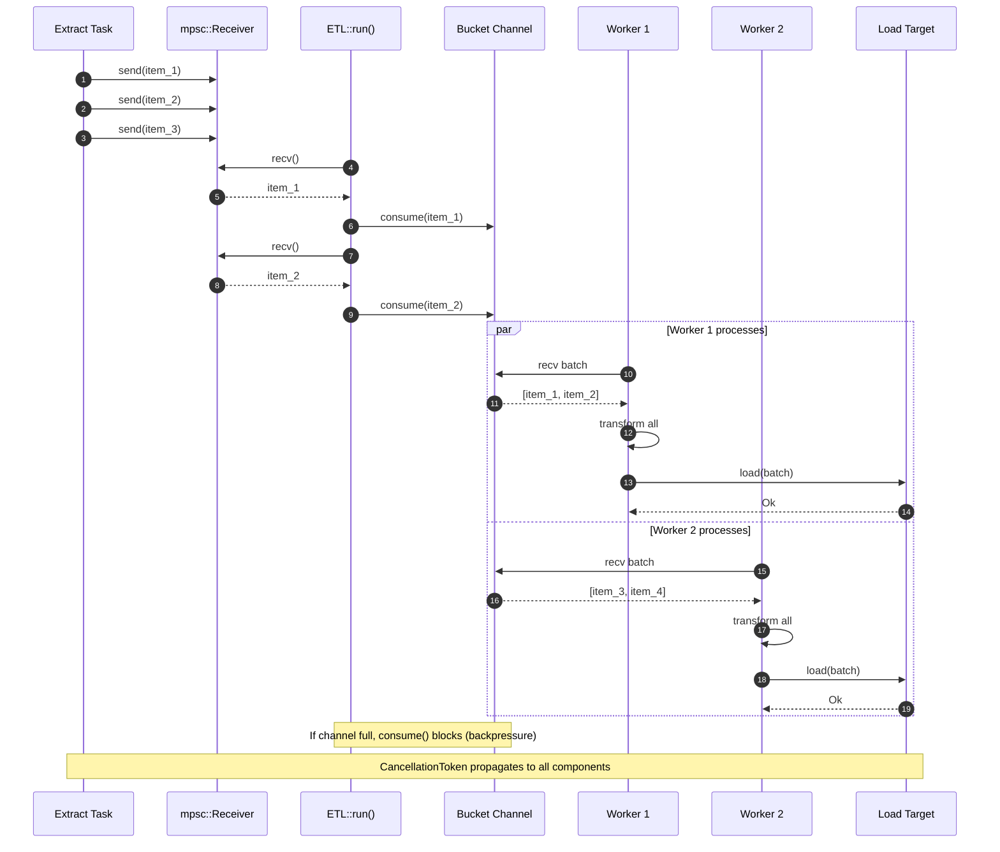
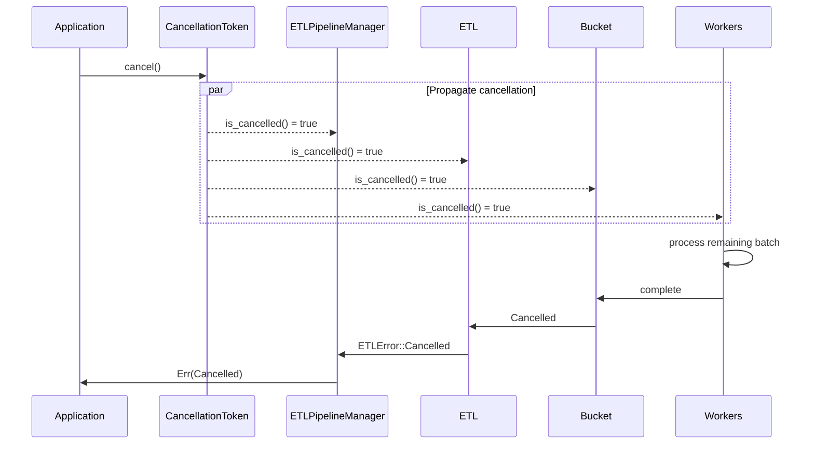

# ETL-Rust

A high-performance, concurrent ETL (Extract, Transform, Load) framework for Rust with batch processing, parallel workers, and zero-copy configuration sharing.

## Features

- **Async/Await Support**: Built on Tokio for efficient async I/O operations
- **Batch Processing**: Configurable batch sizes with automatic timeout-based flushing
- **Parallel Workers**: Multi-threaded processing with configurable worker count
- **ETL Pipeline Manager**: Run multiple ETL pipelines concurrently with zero-copy config sharing
- **Cancellation Support**: Graceful shutdown using `CancellationToken`
- **Flexible Architecture**: Trait-based design for custom ETL implementations
- **Builder Pattern**: Convenient configuration using derive_builder
- **Error Handling**: Comprehensive error handling with custom error types (`ETLError`, `BucketError`)
- **Type Safety**: Leverages Rust's type system for compile-time guarantees

## Installation

Add this to your `Cargo.toml`:

```toml
[dependencies]
etl-rust = "0.1.0"
```

## Quick Start

### Basic ETL Pipeline

```rust
use async_trait::async_trait;
use etl_rust::etl::{ETL, ETLPipeline};
use etl_rust::bucket::ConfigBuilder;
use std::error::Error;
use std::sync::Arc;
use std::time::Duration;
use tokio::sync::mpsc;
use tokio_util::sync::CancellationToken;

#[derive(Clone)]
struct DataItem {
    id: u32,
    value: String,
}

struct MyPipeline;

#[async_trait]
impl ETLPipeline<DataItem, String> for MyPipeline {
    async fn extract(&self, cancel: &CancellationToken) -> Result<mpsc::Receiver<DataItem>, Box<dyn Error>> {
        let (tx, rx) = mpsc::channel(100);
        let cancel_clone = cancel.clone();

        tokio::spawn(async move {
            for i in 0..100 {
                if cancel_clone.is_cancelled() {
                    break;
                }
                if tx.send(DataItem {
                    id: i,
                    value: format!("data_{}", i),
                }).await.is_err() {
                    break;
                }
            }
        });

        Ok(rx)
    }

    async fn transform(&self, _cancel: &CancellationToken, item: &DataItem) -> String {
        format!("{}: {}", item.id, item.value.to_uppercase())
    }

    async fn load(&self, _cancel: &CancellationToken, items: Vec<String>) -> Result<(), Box<dyn Error>> {
        println!("Loading batch of {} items", items.len());
        for item in items {
            println!("  {}", item);
        }
        Ok(())
    }

    async fn pre_process(&self, _cancel: &CancellationToken) -> Result<(), Box<dyn Error>> {
        println!("Starting ETL pipeline...");
        Ok(())
    }

    async fn post_process(&self, _cancel: &CancellationToken) -> Result<(), Box<dyn Error>> {
        println!("ETL pipeline completed!");
        Ok(())
    }
}

#[tokio::main]
async fn main() -> Result<(), Box<dyn Error>> {
    let etl = ETL::from_box(Box::new(MyPipeline));

    let config = Arc::new(
        ConfigBuilder::default()
            .batch_size(10usize)
            .timeout(Duration::from_secs(5))
            .worker_num(4usize)
            .build()?
    );

    let cancel = CancellationToken::new();

    etl.pre_process(&cancel).await?;
    etl.run(config, &cancel).await?;
    etl.post_process(&cancel).await?;

    Ok(())
}
```

### Using the Bucket System Directly

```rust
use async_trait::async_trait;
use etl_rust::bucket::{Bucket, BatchProcessor, BucketError, ConfigBuilder};
use std::time::Duration;
use tokio_util::sync::CancellationToken;

struct MyProcessor;

#[async_trait]
impl BatchProcessor<String> for MyProcessor {
    async fn process(&self, _ctx: &CancellationToken, items: &[String]) -> Result<(), BucketError> {
        println!("Processing {} items: {:?}", items.len(), items);
        Ok(())
    }
}

#[tokio::main]
async fn main() -> Result<(), Box<dyn std::error::Error>> {
    let config = ConfigBuilder::default()
        .batch_size(5usize)
        .timeout(Duration::from_secs(1))
        .worker_num(2usize)
        .build()?;

    let bucket = Bucket::new(config);
    let cancel = CancellationToken::new();

    let bucket_clone = bucket.clone();
    let handle = tokio::spawn(async move {
        bucket_clone.run(&cancel, MyProcessor).await
    });

    for i in 0..20 {
        bucket.consume(format!("item_{}", i)).await?;
    }

    bucket.close().await;
    handle.await??;
    
    Ok(())
}
```

### Running Multiple ETL Pipelines Concurrently

```rust
use async_trait::async_trait;
use etl_rust::etl::{ETLPipeline, ETLPipelineManager};
use etl_rust::bucket::ConfigBuilder;
use std::error::Error;
use std::time::Duration;
use tokio::sync::mpsc;
use tokio_util::sync::CancellationToken;

struct Pipeline1;

#[async_trait]
impl ETLPipeline<i32, String> for Pipeline1 {
    async fn extract(&self, _cancel: &CancellationToken) -> Result<mpsc::Receiver<i32>, Box<dyn Error>> {
        let (tx, rx) = mpsc::channel(100);
        tokio::spawn(async move {
            for i in 1..=10 {
                let _ = tx.send(i).await;
            }
        });
        Ok(rx)
    }

    async fn transform(&self, _cancel: &CancellationToken, item: &i32) -> String {
        format!("Value: {}", item)
    }

    async fn load(&self, _cancel: &CancellationToken, items: Vec<String>) -> Result<(), Box<dyn Error>> {
        println!("Pipeline1 loaded: {:?}", items);
        Ok(())
    }

    async fn pre_process(&self, _cancel: &CancellationToken) -> Result<(), Box<dyn Error>> { Ok(()) }
    async fn post_process(&self, _cancel: &CancellationToken) -> Result<(), Box<dyn Error>> { Ok(()) }
}

#[tokio::main]
async fn main() -> Result<(), Box<dyn Error>> {
    let manager_config = etl_rust::etl::manager::Config::new(4);
    let bucket_config = ConfigBuilder::default()
        .batch_size(5usize)
        .timeout(Duration::from_secs(1))
        .build()?;

    let mut manager = ETLPipelineManager::new(&manager_config, bucket_config);
    
    manager.add_pipeline(Box::new(Pipeline1), "pipeline1".to_string());

    let cancel = CancellationToken::new();
    manager.run_all(&cancel).await?;

    Ok(())
}
```

## Configuration

### Bucket Configuration

Configure batch processing using `ConfigBuilder`:

```rust
use etl_rust::bucket::ConfigBuilder;
use std::time::Duration;

let config = ConfigBuilder::default()
    .batch_size(100usize)
    .timeout(Duration::from_secs(5))
    .worker_num(4usize)
    .build()?;
```

**Parameters:**
- `batch_size`: Maximum number of items in a batch (default: 1)
- `timeout`: Maximum time to wait before processing a partial batch (default: 5 seconds)
- `worker_num`: Number of concurrent worker tasks (default: 1)

### ETL Manager Configuration

Configure pipeline manager execution:

```rust
use etl_rust::etl::manager::Config;

let config = Config::new(4);
```

**Parameters:**
- `worker_num`: Maximum number of concurrent pipeline executions (default: 4)

### Configuration Guidelines

- **batch_size**: Choose based on processing requirements and memory
  - Smaller batches: lower latency, more overhead
  - Larger batches: better throughput, higher memory usage

- **timeout**: Prevents small batches from waiting indefinitely
  - Lower for real-time processing
  - Higher for batch-oriented workloads

- **worker_num**: Number of parallel workers/pipelines
  - Set based on CPU cores and I/O characteristics
  - I/O-bound tasks benefit from more workers than CPU cores

## Architecture

### Components

1. **ETL Module** (`src/etl/`)
   - `ETLPipeline` trait: Define extract, transform, load operations
   - `ETL<E, T>`: Executor for single ETL pipelines
   - `ETLPipelineManager`: Run multiple pipelines concurrently with zero-copy config sharing
   - Lifecycle hooks: `pre_process`, `post_process`

2. **Bucket Module** (`src/bucket/`)
   - `Bucket<T>`: Generic batching processor with concurrent workers
   - `BatchProcessor` trait: Define custom batch processing logic
   - `Config`: Builder-based configuration for batch settings
   - Timeout-based and size-based batch triggers

3. **Key Traits**
   - `ETLPipeline<E, T>`: Define ETL pipeline behavior for types E → T
   - `BatchProcessor<T>`: Define batch processing logic for type T
   - `ETLRunner`: Low-level trait for custom pipeline execution

### Data Flow

```
ETL Pipeline:
Extract → Channel → Transform (parallel) → Bucket → Load (batched)
                         ↑                     ↑
                    Worker Pool          Timeout/Size
                                          Triggers

ETL Manager:
Multiple Pipelines → Semaphore → Concurrent Execution
                         ↑
                   Zero-Copy Config
```

### Sequence Diagram



#### Detailed Component Interactions



#### Cancellation Flow



## Error Handling

Custom error types for different components:

```rust
pub enum BucketError {
    ProcessorError(String),
    ChannelClosed,
    Cancelled,
}

pub enum ETLError {
    PipelineExecution(String, String),
    Configuration(String),
    Cancelled,
    WorkerPool(String),
    Bucket(BucketError),
    Io(std::io::Error),
    BuildError(String),
}
```

## Testing

```bash
cargo test
cargo test -- --nocapture
cargo test test_bucket_batch_processing
```

## Examples

See `examples/` directory:
- `simple_etl.rs` - Basic single ETL pipeline
- `simple_bucket.rs` - Direct bucket usage
- `etl_with_manager.rs` - Multiple concurrent pipelines with ETLPipelineManager

Run examples:
```bash
cargo run --example simple_etl
cargo run --example simple_bucket
cargo run --example etl_with_manager
```

## Performance Considerations

1. **Memory Usage**: Batch size directly impacts memory consumption
2. **Throughput**: Increase workers and batch size for higher throughput
3. **Latency**: Decrease timeout and batch size for lower latency
4. **Backpressure**: Channel sizes provide natural backpressure

## Contributing

Contributions are welcome! Please feel free to submit a Pull Request.

## License

This project is licensed under the MIT License - see the LICENSE file for details.

## Roadmap

- [ ] Add metrics and monitoring support
- [ ] Implement retry mechanisms with backoff strategies
- [ ] Add more transformation operators and combinators
- [ ] Support for distributed processing
- [ ] Compression and serialization options
- [ ] Checkpoint/resume functionality
- [ ] Rate limiting and throttling
- [ ] Dead letter queue for failed items